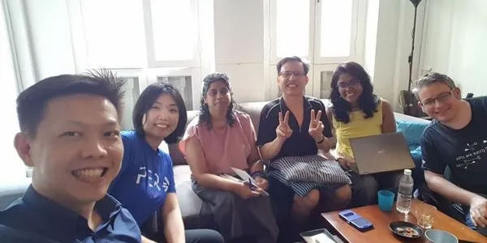
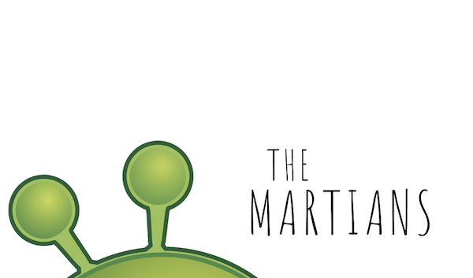

# Meet the Martians

### Global minds with flexible working hours – staying productive together, inspiring one another, and having fun!

## About Us

Have you ever felt like you lived in your own timezone? You could be a solo founder trying to get your startup off the ground, an office worker whose colleagues are spread out in different parts of the world, or a freelancer whose schedule depends on what projects you have taken on at the moment. We aim to find creative ways to stay functional, take advantage of our flexible schedules to explore venues together, and to open our minds to new ideas and people.

'The Martians' is a not-for-profit organization and we constantly looking for partners to build an ecosystem where everybody wins.

## Connect with us

hello@martians.sg

[Our Page on LinkedIn](https://www.linkedin.com/company/30963835)

[Our YouTube Channel](https://www.youtube.com/channel/UCTEeHqSVYES0BNS_yaGgvcQ)

